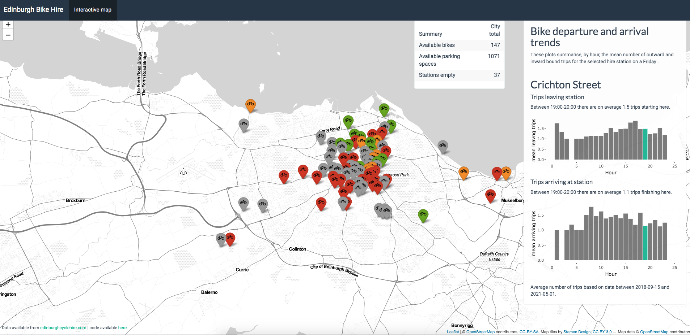

# Summary

Interactive map of Edinburgh bike hire stations. Click the map pins to learn:

* The number of available bikes;
* The number of available parking spots, and;
* The average (mean) number of trips taken from said station for today's day of week and time.

Some functions are based on those found in the [byskkel](https://rdrr.io/cran/bysykkel/) library. 
The Shiny functions, css and javascript files are based on the [SuperZip example](https://shiny.rstudio.com/gallery/superzip-example.html).

Very much work in progress. Lots of issues!

You can see a version of the app [running here](https://diarmuid.shinyapps.io/edinburgh_bike_hire_app/). 

